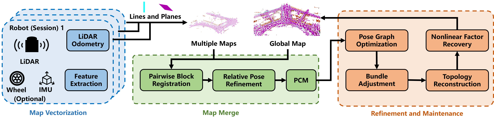

<!-- # <div align = "center"> SLABIM: </div> -->

## <div align = "center">SLIM: Scalable and Lightweight LiDAR Mapping in Urban Environments</div>

<h3 align="center">
  <a href="https://arxiv.org/pdf/2409.08681">arXiv</a> |
  <a href="https://www.youtube.com/watch?v=8HQnYMf_BWI">Video</a>
</h3>


<div align="center">
<!-- <a href="https://ieeexplore.ieee.org/document/10518010"></a>
<a href="https://arxiv.org/abs/2308.11573"></a>
<a href="https://youtu.be/4OeZ9bVsxcY?si=180BzZ-lxak1iq69">

</a> -->
<!-- <a ></a>
<a href="https://github.com/HKUST-Aerial-Robotics/G3Reg/issues">

</a> -->
</div>

> Zehuan Yu, [Zhijian Qiao](https://qiaozhijian.github.io/), Wenyi Liu, [Huan Yin](https://huanyin94.github.io/) and [Shaojie Shen](https://uav.hkust.edu.hk/group/)
>
<!-- > 2025 IEEE International Conference on Robotics & Automation -->

<!-- 
### News
* **`15 Sep 2024`:** We submit our paper to [IEEE ICRA](https://2025.ieee-icra.org/). -->
## Introduction
This is the official code repository of "SLIM: Scalable and Lightweight LiDAR Mapping in Urban Environments". SLIM is a scalable multi-session SLAM algorithm. It enables the construction of vectorized maps and supports scalable map merging. It provides a effective solution for multi-session mapping and is easily extensible, to crowdsourcing visual vectorized maps in autonomous driving.

<div align = "center"> </div>

**Features**:
+ **Vectorized LiDAR Mapping with Bundle Adjustment**:
+ **Scalable Map Merging for Vectorized Map**
+ **Relocalization on Vectorized Map**
+ **General Solution for Sparsification in Graph-based SLAM**

## Code
Code will be released after manuscript dicision.
<!-- Please visit [SLABIM_Google_Drive]() to check and download data. -->

## Acknowledgements
This work was supported in part by the HKUST Postgraduate Studentship,
and in part by the HKUST-DJI Joint Innovation Laboratory.

<!-- ## Citation
If you find SLABIM is useful in your research or applications, please consider giving us a star 🌟 and citing it by the following BibTeX entry. -->
<!-- ```bibtex
@ARTICLE{qiao2024g3reg,
  author={Qiao, Zhijian and Yu, Zehuan and Jiang, Binqian and Yin, Huan and Shen, Shaojie},
  journal={IEEE Transactions on Automation Science and Engineering}, 
  title={G3Reg: Pyramid Graph-Based Global Registration Using Gaussian Ellipsoid Model}, 
  year={2024},
  volume={},
  number={},
  pages={1-17},
  keywords={Point cloud compression;Three-dimensional displays;Laser radar;Ellipsoids;Robustness;Upper bound;Uncertainty;Global registration;point cloud;LiDAR;graph theory;robust estimation},
  doi={10.1109/TASE.2024.3394519}}
```
```bibtex
@inproceedings{qiao2023pyramid,
  title={Pyramid Semantic Graph-based Global Point Cloud Registration with Low Overlap},
  author={Qiao, Zhijian and Yu, Zehuan and Yin, Huan and Shen, Shaojie},
  booktitle={2023 IEEE/RSJ International Conference on Intelligent Robots and Systems (IROS)},
  pages={11202--11209},
  year={2023},
  organization={IEEE}
}
``` -->